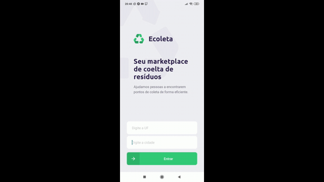

<h1 align="center">
    
</h1>

<h4 align="center"> 
  NextLevelWeek 1.0 🚀 By <a href="https://rocketseat.com.br/">Rocketseat</a>
</h4>
<p align="center">
  

  
	
  <a href="https://www.linkedin.com/in/felipe-melo-a78504186/">
    
  </a>

  <a href="https://github.com/felipefrm/ecoleta/commits/master">
    
  </a>

  
</p>

<p align="center">
  <a href="#nlw">Next Level Week</a>&nbsp;&nbsp;&nbsp;|&nbsp;&nbsp;&nbsp;
  <a href="#projeto">Projeto</a>&nbsp;&nbsp;&nbsp;|&nbsp;&nbsp;&nbsp;
  <a href="#tecnologias">Tecnologias</a>&nbsp;&nbsp;&nbsp;|&nbsp;&nbsp;&nbsp;
  <a href="#layout">Layout</a>&nbsp;&nbsp;&nbsp;|&nbsp;&nbsp;&nbsp;
  <a href="#resultado">Resultado</a>&nbsp;&nbsp;&nbsp;|&nbsp;&nbsp;&nbsp;
  <a href="#como-usar">Como usar</a>&nbsp;&nbsp;&nbsp;|&nbsp;&nbsp;&nbsp;
  <a href="#como-contribuir">Como contribuir</a>&nbsp;&nbsp;&nbsp;|&nbsp;&nbsp;&nbsp;
  <a href="#licenca">Licença</a>
</p>

<a id="nlw"></a>
## :information_source: Next Level Week

#### "O NLW é uma experiência online com muito conteúdo prático, desafios e hacks que vão te ajudar avançar para o próximo nível."

Disponibilizado pela Rocketseat, o Next Level Week é um curso para desenvolver uma aplicação completa do 0, utilizando todo o potencial da stack ReactJs, React Native e NodeJS. No projeto foi dedicado 7 dias para o desenvolvimento do projeto Ecoleta. 

<a id="projeto"></a>
## 💻 Ecoleta

O Ecoleta é uma aplicação Web e Mobile para ajudar pessoas a encontrarem pontos de coleta para reciclagem.

<h1 align="center">
    
</h1>

As empresas ou entidades poderão se cadastrar na plataforma web enviando:
- uma imagem do ponto de coleta
- nome da entidade, email e whatsapp
- e o endereço para que ele possa aparecer no mapa
- além de selecionar um ou mais ítens de coleta: 
  - lâmpadas
  - pilhas e baterias
  - papéis e papelão
  - resíduos eletrônicos
  - resíduos orgânicos
  - óleo de cozinha

Os usuários terão acesso ao aplicativo móvel, onde poderão:
- navegar pelo mapa para ver as instituições cadastradas
- entrar em contato com a entidade através do E-mail ou do WhatsApp

<a id="tecnologias"></a>
## :rocket: Tecnologias

Este projeto foi desenvolvido utilizando as seguintes tecnologias:

- [Node.js][nodejs]
- [TypeScript][typescript]
- [React][reactjs]
- [React Native][rn]
- [Expo][expo]
- [SQLite](https://www.sqlite.org/index.html)

<a id="layout"></a>
## 🔖 Layout

O layout do projeto pode ser visto através do [Figma](https://www.figma.com/file/1SxgOMojOB2zYT0Mdk28lB/).

<a id="resultado"></a>
## :heavy_check_mark: Resultado

- Web (Cadastro de ponto de coleta)


- Mobile (busca de pontos de coleta)



<a id="como-usar"></a>
## :information_source: Como usar

- ### **Pré-requisitos**

  - É **necessário** possuir o **[Node.js](https://nodejs.org/en/)** instalado na máquina
  - Também, é **preciso** ter um gerenciador de pacotes seja o **[NPM](https://www.npmjs.com/)** ou **[Yarn](https://yarnpkg.com/)**.
  - Por fim, é **essencial** ter o **[Expo](https://expo.io/)** instalado de forma global na máquina

1. Faça um clone :

```sh
  $ git clone https://github.com/felipefrm/ecoleta.git
```

2. Executando a Aplicação:

```sh
  # Instale as dependências
  $ npm install

  ## Crie o banco de dados
  $ cd server
  $ npm run knex:migrate
  $ npm run knex:seed

  # Inicie a API
  $ npm run dev

  # Inicie a aplicação web
  $ cd web
  $ npm start

  # Inicie a aplicação mobile
  $ cd mobile
  $ npm start
```
<a id="como-contribuir"></a>
## 🤔 Como contribuir

- Faça um fork;
- Crie uma branch com a sua feature: `git checkout -b my-feature`;
- Faça um commit com suas mundaças: `git commit -m 'feat: My new feature'`;
- Dê um push para sua branch: `git push origin my-feature`.

<a id="licenca"></a>
## :memo: Licençe

Esse projeto está sob a licença MIT. Veja o arquivo [LICENSE](https://github.com/felipefrm/ecoleta/blob/master/LICENSE) para mais detalhes.


<h4 align="center">
    Feito por 💜  <a href="https://www.linkedin.com/in/vitor-serrano/" target="_blank">Felipe Melo</a>
</h4>

[nodejs]: https://nodejs.org/
[typescript]: https://www.typescriptlang.org/
[expo]: https://expo.io/
[reactjs]: https://reactjs.org
[rn]: https://facebook.github.io/react-native/
[yarn]: https://yarnpkg.com/
[vs]: https://code.visualstudio.com/
[vceditconfig]: https://marketplace.visualstudio.com/items?itemName=EditorConfig.EditorConfig
[vceslint]: https://marketplace.visualstudio.com/items?itemName=dbaeumer.vscode-eslint
[prettier]: https://marketplace.visualstudio.com/items?itemName=esbenp.prettier-vscode
